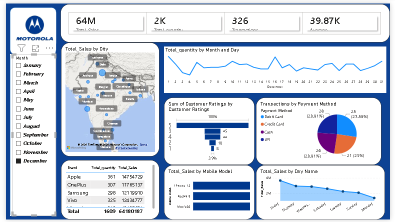

# 📱 Mobile Sales Dashboard | Microsoft Power BI

## 📌 Project Overview

This project is an interactive Mobile Sales Dashboard developed using Microsoft Power BI. It provides insights into mobile sales performance across different cities, brands, payment methods, customer ratings, and sales trends. The dashboard helps businesses make data-driven decisions through interactive visualizations and KPIs.

---

## 📊 Dashboard Screenshot

> Make sure your screenshot is uploaded to the repository with the name **Dashboard_Screenshot.png**.

---

## 🚀 Features

- Interactive dashboard with month slicer
- Sales analysis by city
- Brand-wise sales performance
- Mobile model analysis
- Customer ratings analysis
- Payment method analysis
- Daily sales trend
- Salesperson performance
- KPI Cards (Total Sales, Quantity, Transactions, Average Sales)

---

## 🛠️ Tools Used

- Microsoft Power BI
- Power Query
- DAX (Data Analysis Expressions)
- Data Modeling
- Data Visualization

---

## 📈 KPIs

| KPI | Value |
|------|-------|
| Total Sales | 64M |
| Total Quantity | 2K |
| Total Transactions | 326 |
| Average Sales | 39.87K |

---

## 💡 Business Insights

- Apple generated the highest sales among all brands.
- UPI, Debit Card, Credit Card, and Cash payment methods are almost equally used.
- Monthly sales trends help identify peak sales periods.
- Customer ratings provide insights into customer satisfaction.
- Sales distribution across cities helps identify high-performing markets.

---

## 📂 Dataset

The dataset includes:

- Date
- City
- Brand
- Mobile Model
- Sales Amount
- Quantity
- Customer Rating
- Payment Method
- Salesperson

---

## 👨‍💻 Author

**Yogesh Kumare**

- GitHub: https://github.com/Vihaanyo2
- LinkedIn: *(Add your LinkedIn profile link here)*

---

⭐ If you found this project useful, don't forget to star the repository!
